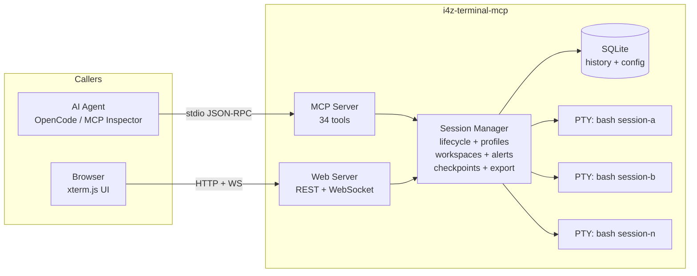
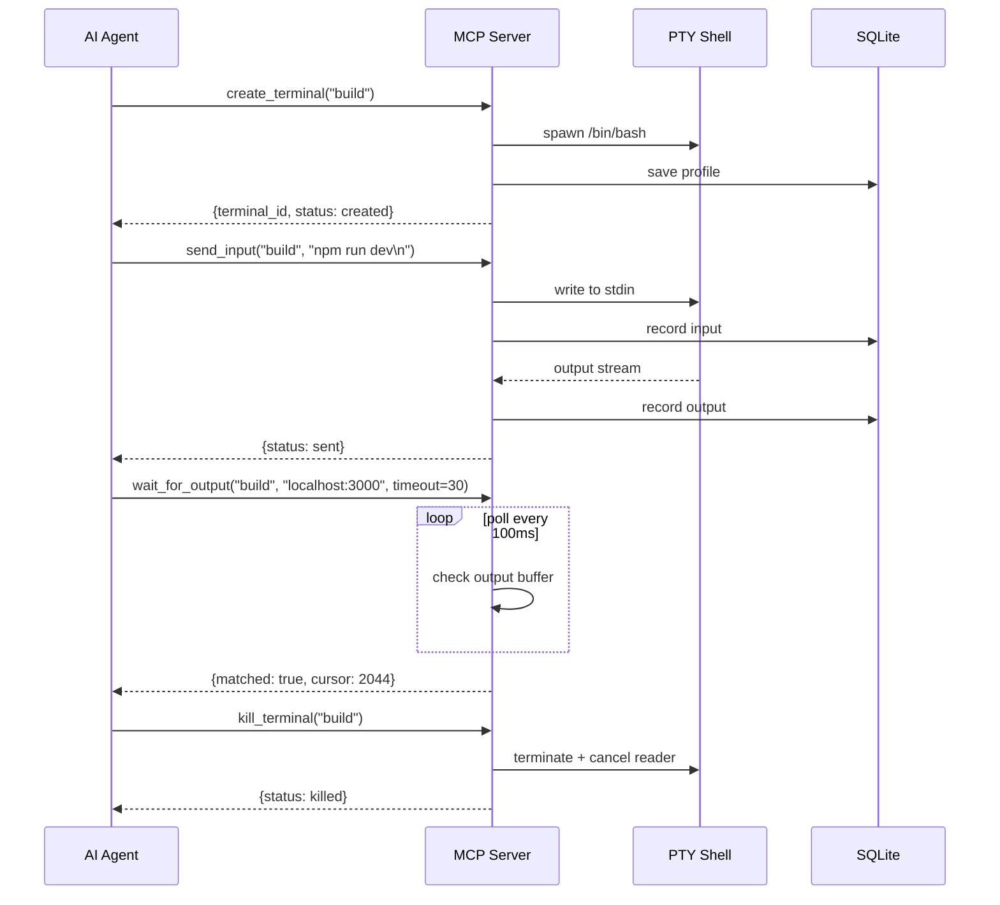

# i4z-terminal-mcp

MCP server that gives AI agents real, persistent terminal sessions — with a browser UI to watch everything live. **Dual implementation**: Python (reference) + Rust (high-performance port).



## Why agents struggle with terminals

Most AI agents run shell commands by spawning a fresh subprocess per call. That works for `ls` or `echo`, but falls apart when things get real:

- **No persistence** — each tool call is a blank slate
- **No interactivity** — long-running processes block or time out
- **Blind output** — no streaming, no polling
- **No parallelism** — one command at a time
- **No recovery** — can't interrupt, inspect, or retry

## How i4z-terminal-mcp fixes this

| Problem | Solution |
|---|---|
| No state between calls | Persistent PTY sessions — `cd`, `export`, `venv` carry forward |
| Can't run background processes | Multiple named terminals, each runs independently |
| Output arrives too late | `read_output` streams incrementally with a cursor |
| Can't interact with running processes | `send_input` at any time; `send_signal` for SIGINT/TERM/KILL |
| No visibility | Browser UI with xterm.js — live terminal rendering |
| Hard to debug | Full SQLite history — every input, output, alert, checkpoint |

## Project Structure

```
i4z-terminal-mcp/
├── Cargo.toml           # Cargo workspace root
├── crates/
│   └── server/          # Server: main, tools, manager, history, session, web
├── Makefile             # Build/run/test targets
├── README.md            # This file
└── spec.md              # Full specification
```

## Quick Start

```bash
# Build & run (Rust)
make rs-run

# Release build & run
make rs-run-release

# Test & benchmark
make test
make bench
make stress
```

## Key Workflows



## Features

- **34 MCP tools** — create, send, read, signal, kill, wait, search, alerts, workspaces, checkpoints, export, import, health
- **PTY-backed bash sessions** — real ANSI/color support
- **Multiple concurrent terminals** — named, independent, parallel
- **Incremental output reads** — cursor-based, bounded buffer (5000 entries)
- **Workspace profiles** — shared env vars + startup commands across terminal groups
- **Output alerts** — pattern-based watchers, global or per-session
- **Session checkpoints** — named positions in output history
- **Export/import** — snapshot + restore full session bundles
- **Browser UI** — xterm.js with sidebar, tabs, split view, dark/light theme
- **Full SQLite history** — input/output events, searchable, survives restarts

## MCP Tools (34)

| Category | Tools |
|---|---|
| Lifecycle | `create_terminal`, `list_terminals`, `terminal_status`, `kill_terminal`, `rename_terminal` |
| I/O | `send_input`, `read_output`, `wait_for_output`, `search_output` |
| Signals | `send_signal` |
| Config | `terminal_profile`, `configure_terminal`, `resize_terminal` |
| Workspaces | `create_workspace`, `list_workspaces`, `workspace_status`, `configure_workspace`, `add_terminal_to_workspace`, `remove_terminal_from_workspace`, `apply_workspace` |
| Alerts | `add_output_alert`, `list_output_alerts`, `remove_output_alert`, `list_alert_events` |
| Checkpoints | `add_checkpoint`, `list_checkpoints`, `remove_checkpoint` |
| Snapshots | `export_session`, `import_session` |
| Info | `health_report`, `web_url` |

## Implementation Comparison

| | Python | Rust |
|---|---|---|
| Runtime | asyncio | tokio |
| PTY | pexpect | pty-process + libc |
| Web | Starlette + uvicorn | actix-web + actix-ws |
| MCP | mcp (Python SDK) | rmcp (Rust SDK) |
| DB | sqlite3 (sync) | SQLx (async) |
| Output buffer | deque(maxlen=5000) | VecDeque(maxlen=5000) |
| ANSI strip | regex sub | regex replace |
| Concurrency | asyncio tasks | tokio tasks + DashMap |
| Frontend | inline HTML string | `include_str!` at compile |
| IDs | uuid.uuid4().hex | uuid::Uuid::new_v4() |
| Binary size | ~2MB (interpreted) | ~15MB (compiled) |
| Startup | ~200ms (imports) | ~3ms (native) |
| Throughput | ~2k cmd/s | ~9k cmd/s |

## Configuration

| Env Var | Default | Description |
|---|---|---|
| `I4Z_TERMINAL_WEB_PORT` | random free | Web UI listen port |
| `I4Z_TERMINAL_WEB_HOST` | `0.0.0.0` | Web UI bind address |
| `I4Z_TERMINAL_STATE_DIR` | `~/.local/share/i4z-terminal-mcp` | SQLite storage |

## Requirements

- **Python**: 3.11+, Linux/macOS
- **Rust**: stable toolchain, Linux/macOS

## License

MIT
