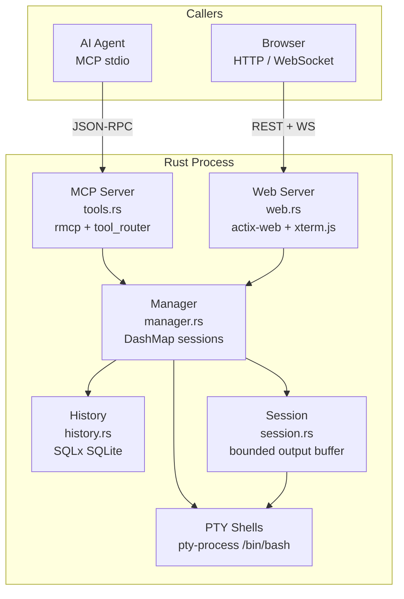
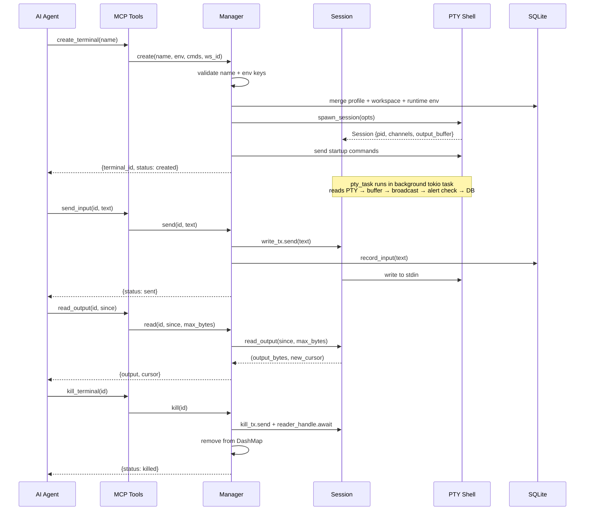

# i4z-terminal-mcp (Rust)

High-performance Rust port — tokio async, `pty-process` PTY, SQLx SQLite, actix-web server with xterm.js frontend. Full feature parity with Python reference implementation.



## Structure

```
rust/
├── src/
│   ├── main.rs         # Entry point: web server + MCP server + signal handling
│   ├── lib.rs          # Module exports (shared across bin + tests)
│   ├── tools.rs        # 34 MCP tools via rmcp proc-macro
│   ├── manager.rs      # Manager: session lifecycle, I/O, profiles, alerts, checkpoints
│   ├── history.rs      # History: SQLx SQLite (events, profiles, alerts, bookmarks, workspaces)
│   ├── session.rs      # Session: PTY wrapper, bounded deque output buffer, CWD detection
│   ├── web.rs          # actix-web server: 25 REST endpoints + WebSocket + HTML UI
│   ├── error.rs        # Error types
│   └── bin/
│       ├── bench.rs    # Benchmark tool
│       └── stress.rs   # Stress test (20 concurrent sessions)
├── tests/
│   └── parity.rs       # Python vs Rust parity tests
├── migrations/
│   └── 001_initial.sql # Legacy migration (superseded by inline schema)
├── index.html          # xterm.js frontend (included at compile time)
└── Cargo.toml          # Dependencies + 3 binary targets
```

## How It Works

### Architecture



### Key Design Decisions

| Decision | Why |
|---|---|
| `tokio::spawn` per PTY reader | True concurrency; each session gets its own task |
| DashMap (lock-free concurrent HashMap) | Safe concurrent session access without RwLock |
| tokio channels (mpsc + broadcast) | Decoupled I/O: sender doesn't block on PTY writes |
| Bounded deque output buffer (5000 entries) | Parity with Python; cursor-based incremental reads |
| ANSI stripping via regex | Clean history storage; raw output kept in memory |
| UUID-based alert/checkpoint IDs | Hex strings match Python's `uuid.uuid4().hex` |
| actix-web + actix-ws | Fast HTTP + native WebSocket without external runtime |
| rmcp proc-macro tool_router | Compile-time tool registration; schema auto-generated |
| `include_str!("../index.html")` | Frontend baked into binary at compile time |
| Graceful shutdown via `signal::ctrl_c()` | SIGINT/SIGTERM → kill all sessions → clean exit |

### Running

```bash
# Debug build (from workspace root)
cargo run -p i4z-terminal-mcp

# Release build (recommended)
cargo build --release -p i4z-terminal-mcp
./target/release/i4z-terminal-mcp
```

### Configuration

| Env Var | Default | Description |
|---|---|---|
| `I4Z_TERMINAL_WEB_PORT` | random free | Web UI listen port |
| `I4Z_TERMINAL_WEB_HOST` | `0.0.0.0` | Web UI bind address |
| `I4Z_TERMINAL_STATE_DIR` | `~/.local/share/i4z-terminal-mcp` | SQLite storage |
| `RUST_LOG` | `i4z_terminal_mcp=info` | Tracing filter |

### Testing & Benchmarking

```bash
make test      # cargo test (unit + parity tests)
make bench     # cargo run --release --bin bench
make stress    # cargo run --release --bin stress
```

### Parity with Python

| Feature | Status |
|---|---|
| PTY shell spawn with env | ✓ |
| Output buffer (bounded deque, cursor) | ✓ |
| ANSI stripping before DB write | ✓ |
| 34 MCP tools | ✓ |
| 25 REST endpoints + WebSocket | ✓ |
| Workspace profiles (env + startup + members) | ✓ |
| Output alerts (global + session) | ✓ |
| Checkpoints (named cursor positions) | ✓ |
| Session export/import | ✓ |
| Terminal rename (7 DB tables) | ✓ |
| Dead terminal history access | ✓ |
| CWD detection (/proc/pid/cwd) | ✓ |
| Graceful shutdown | ✓ |
| Interactive/dumb terminal toggle | ✓ |
