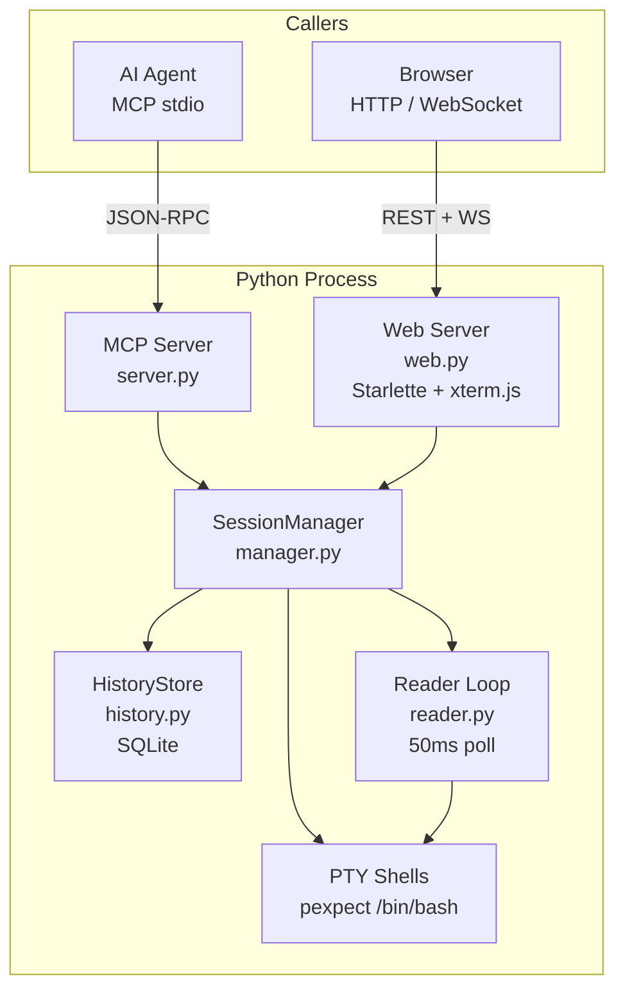
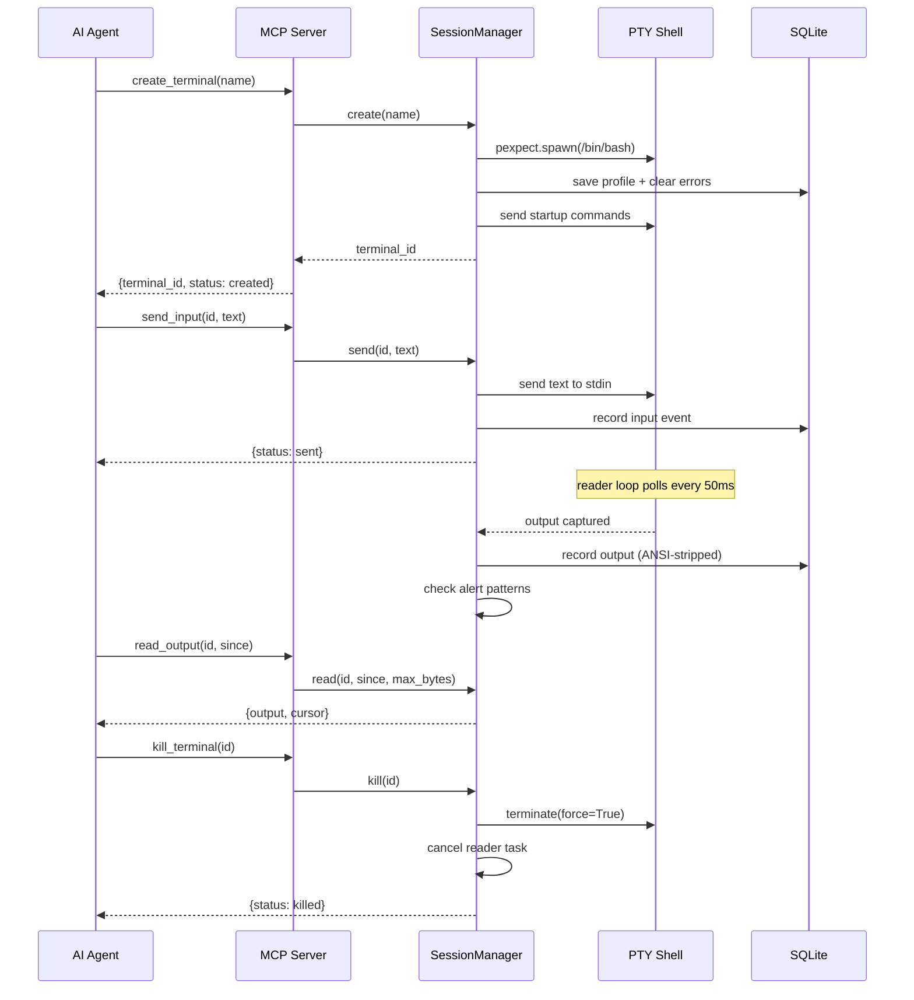

# i4z-terminal-mcp (Python)

Python reference implementation — asyncio, pexpect PTY, SQLite history, Starlette web server with xterm.js frontend.



## Structure

```
python/
├── terminal/
│   ├── server.py       # MCP entry point, stdio transport, tool dispatch
│   ├── tools.py        # 34 MCP tool JSON schemas
│   ├── manager.py      # SessionManager: lifecycle, profiles, workspaces, alerts
│   ├── history.py      # HistoryStore: SQLite events/profiles/alerts/bookmarks
│   ├── session.py      # TerminalSession: PTY wrapper, output buffer, cursor
│   ├── reader.py       # Background asyncio reader (50ms poll)
│   ├── signals.py      # POSIX signal dispatch (SIGINT/TERM/KILL)
│   ├── web.py          # Starlette web server + xterm.js HTML UI + REST + WS
│   └── log.py          # Structured stderr logger with prefixes
├── pyproject.toml      # Package metadata, hatchling build, entry point
├── requirements.txt
├── demo.py             # MCP client demo (create, send, read, kill)
└── test.html           # Browser test page
```

## How It Works

### Terminal Lifecycle



### Key Design Decisions

| Decision | Why |
|---|---|
| asyncio event loop | Non-blocking I/O for MCP stdio + web server + 20 PTY readers |
| SQLite per-process (pid in filename) | No cross-contamination between server instances |
| ANSI stripped before DB | Clean history for search; raw output still in memory buffer |
| Output buffer = deque(maxlen=5000) | Bounded memory, cursor-based incremental reads |
| Reader loop polls every 50ms | Tradeoff: simpler than select-based, low enough latency |
| Workspace = env + startup + member list | Group terminals with shared configuration |
| Alerts = pattern-on-output watchers | Global or per-session, fire alert events |
| Checkpoints = named cursor positions | Reference points in output history for later lookup |

### Running

```bash
cd python && pip install -e .
i4z-terminal-mcp                           # random web port
I4Z_TERMINAL_WEB_PORT=9020 i4z-terminal-mcp  # fixed port
```

### Configuration

| Env Var | Default | Description |
|---|---|---|
| `I4Z_TERMINAL_WEB_PORT` | random free | Web UI listen port |
| `I4Z_TERMINAL_WEB_HOST` | `0.0.0.0` | Web UI bind address |
| `I4Z_TERMINAL_STATE_DIR` | `~/.local/share/i4z-terminal-mcp` | SQLite storage |
